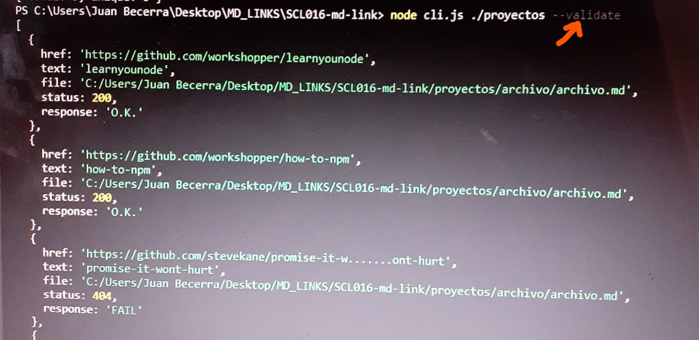
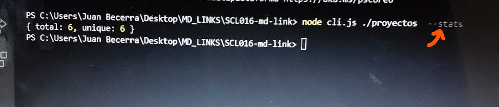
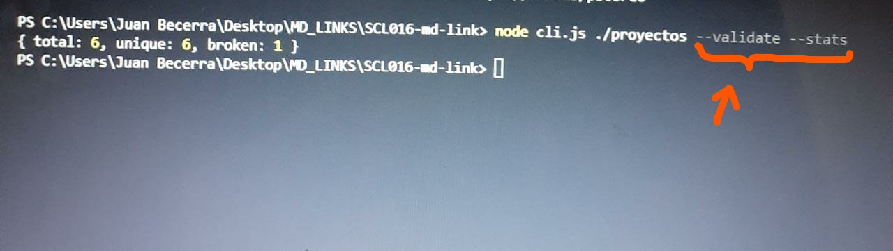

# Markdown Links

Esta libreria fue creada usando Node.js, su funcion es leer y encontrar  los archivos con extensión ".md", extraer sus links y mostrarlo en la terminal. Por medio del comando --validate, muestra el estado de los links.función de leer y analizar archivos en formato Markdown desde el input de un archivo hasta un directorio. Extrae links de los archivos y los verifica el status de los links y saca estadísticas cómo total de links, links que no funcionan y unicos.

Encuentra (lee) los archivos con extensión ".md". *Muestra en la terminal todos los links encontrados en el archivo, además de su texto y la ruta. *Por medio del comando --validate, muestra el estado de los links.

## Indice

* [1. Plan de Acción](#1-plan-de-acción)
* [2. Diagrama de flujo](#2-diagrama-de-flujo)
* [3. Descarga e instalacón de NODE](#3-descarga-e-instalacón-de-node)
* [4. Instalación de dependencias](#4-instalación-de-dependencias)
* [5. Guía de Uso e Instalación de la librería](#5-guía-de-uso-e-instalación-de-la-librería)
* [6. Respuesta en la terminal segun opción seleccionada](#6-respuesta-en-la-terminal-segun-opción-seleccionada)
***

## 1. Plan de Acción

* planificación en git 
* descargar Node.js
* analisis del proyecto
* crear un diagrama de flujo del recorrido de debería hacer el programa para cumplir con los objetivos de este, y asi identificar las funciones necesarias.
* buscar y probar las funciones.
* implementar test
* Unir organizar funciones, crear función md-links

## 2. Diagrama de flujo

## 3. Descarga e instalacón de NODE
Instalación de Node.js
La instalación de Node.js es tan sencilla como ir a la página web del proyecto, [Descargar](https://nodejs.org/en/) el instalador para nuestro sistema operativo y ejecutar este.
Una vez finalizada la instalación de Node.js se puede abrir una terminal, donde puedes:
 comprobar la versión instalada escribiendo en la terminal el comando node --version. También se puede comprobar la versión de npm, el gestor de paquetes que utiliza Node.js, escribiendo el comando npm --version. Al igual que el caso anterior debería aparecer el número de versión. 

## 4. Instalación de dependencias
 La documentacíon de estas dependencias la encontraras [Aqui](https://nodejs.org/api/cli.html#cli_unhandled_rejections_mode)

 ### $ npm install --save-dev jest  
 ### $ npm i chalk  
 ### $ npm install node-fetch

## 5. Guía de Uso e Instalación de la librería
### Instalación
Con el comando

 npm install @mailys50/md-links podemos instalar directamente.
                                 
## 6. Respuesta en la terminal segun opción seleccionada
Respueta obtenida con la opción:
 ## --validate

Respueta obtenida con la opción:
 ## --stats

Respueta obtenida con la opción:
 ## --stats --validate
